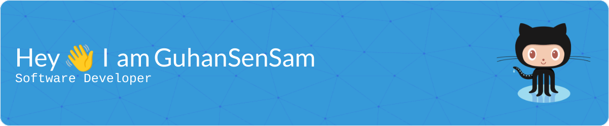

[](https://wakatime.com/@47552522-5c3d-4509-a300-fbac59edf0f4)

### About Me

* 🖥️ I am a self-taught developer who loves working on applications and digging around in backend code!
* 📕 Currently pursuing a Bachelor of Computer Science in Computer Science Engineering in Vellore Institute of Technology, Chennai, Tamil Nadu, India.
* 🧑🏽‍💻 My technical interest are application development, backend programming and Data Structures and Algorithms.
* 📸 My hobbies include photography, video editing and 3D Visual Effects

### My Tech Stack:


### Platforms I Target:


### My Stats
[](https://git.io/streak-stats)

#### The time I spent this week coding
<!--START_SECTION:waka-->

```txt
C#           7 hrs 30 mins   ███████▓░░░░░░░░░░░░░░░░░   30.00 %
YAML         5 hrs 7 mins    █████░░░░░░░░░░░░░░░░░░░░   20.43 %
JavaScript   4 hrs 17 mins   ████▒░░░░░░░░░░░░░░░░░░░░   17.14 %
XML          1 hr 48 mins    █▓░░░░░░░░░░░░░░░░░░░░░░░   07.21 %
GDScript3    1 hr 40 mins    █▓░░░░░░░░░░░░░░░░░░░░░░░   06.71 %
```

<!--END_SECTION:waka-->

#### How Much I have Coded Since I started
<a href="https://wakatime.com"></a>

### Contact

<a href="https://www.linkedin.com/in/guhan-sambandam"></a>
<a href="[https://mobile.twitter.com/gsensam"></a>
<a href="https://www.instagram.com/guhan_sensam/"></a>


